
<h1 align="center">智能物流管理系统</h1>

## 简介
智能物流管理系统：支持订单管理、员工和门店信息管理、库存监控、运输调度和数据分析等功能，提升物流效率和管理便利性，适用管理员和用户使用。    --计算机毕业设计源码；毕设源码；java毕业设计源码

## 联系方式

<h3 align="center">获取完整代码与数据库文件 + 微信：deepguan QQ: 86050149 QQ群: 783742310</h3>

<h3 align="center">可帮忙远程部署 包运行成功！提供远程部署、修改代码、设计文档指导、代码讲解等服务！</h3>

## 功能介绍（完整见运行截图）
管理员： 基本功能包括登录、退出、权限管理和员工管理等。系统界面设计简洁，其中包含多种管理模块，如店主管理、门店信息管理、订单信息管理和工作日志管理。管理员还可以通过数据统计与分析功能提升物流效率及运营决策的科学性。界面便捷，支持快速导航至订单管理、运输调度、库存监控，以及详细操作如查看、编辑与删除。

员工： 系统提供员工的信息录入、查看及修改功能，包括工号、姓名、性别、部门、联系方式等基本资料的管理。员工还可以管理和跟踪工作日志，填写工作内容、问题及总结，确保工作任务的有效执行。界面支持员工对订单、库存和工作日志的实时查看与更新功能，以提升日常操作的便捷性和准确性。

顾客： 系统为顾客提供简易的注册和登录功能，并支持个人信息的查看与管理，如昵称、联系电话、邮箱等。顾客可以直接访问订单信息和物流进展，进行在线查询及状态跟踪，以便于物流订单的处理和个人货物的管理。顾客界面还提供修改个人信息的选项，保证信息的及时更新与安全性。

店主： 店主在系统中可以管理店铺信息，包括店铺名称、位置、电话和状态等基本信息的查看与更新。功能模块允许店主进行订单管理、员工分配和库存监控，以帮助优化日常物流操作。店主还可通过系统的运输调度功能提高配送效率，确保物流服务质量与客户满意度。系统界面支持快速查找及发布相关日志，提高信息管理的流畅性和操作性。

## 运行截图
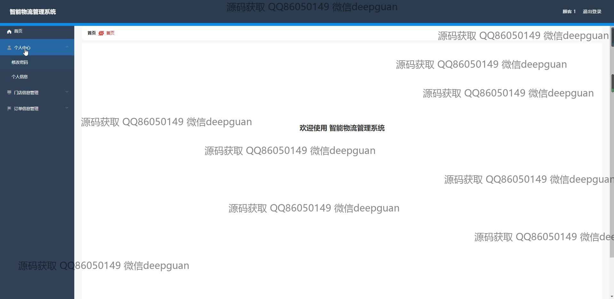
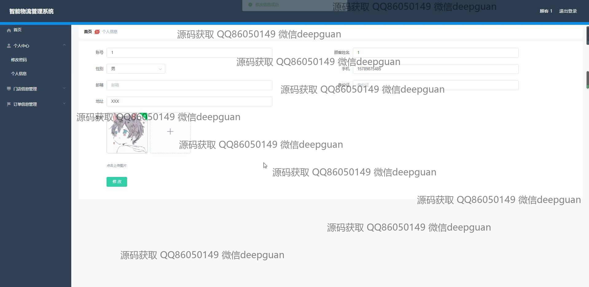
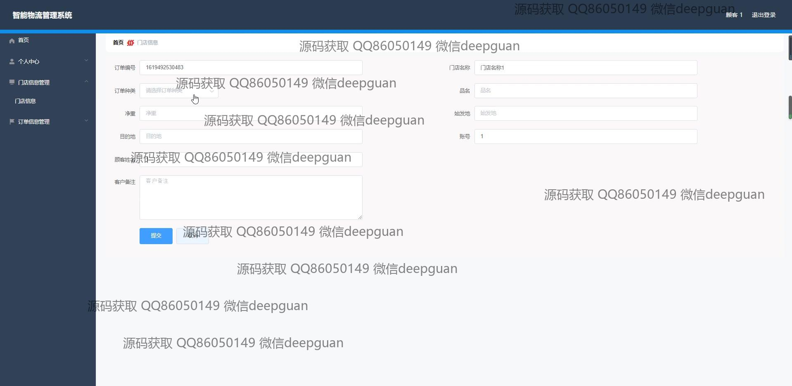
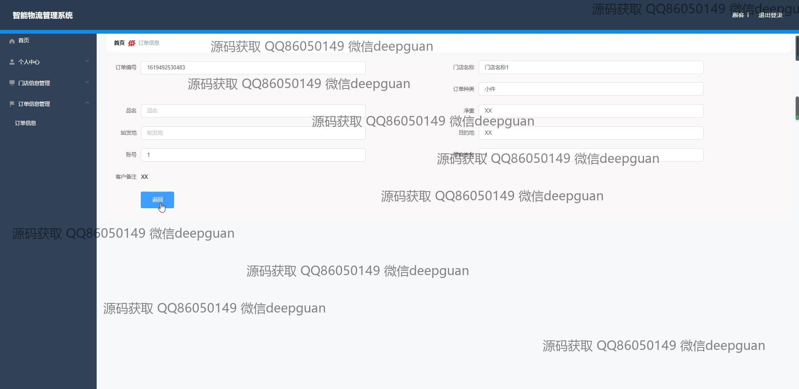

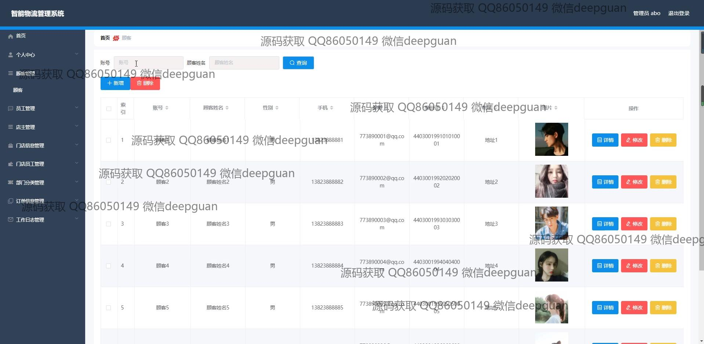
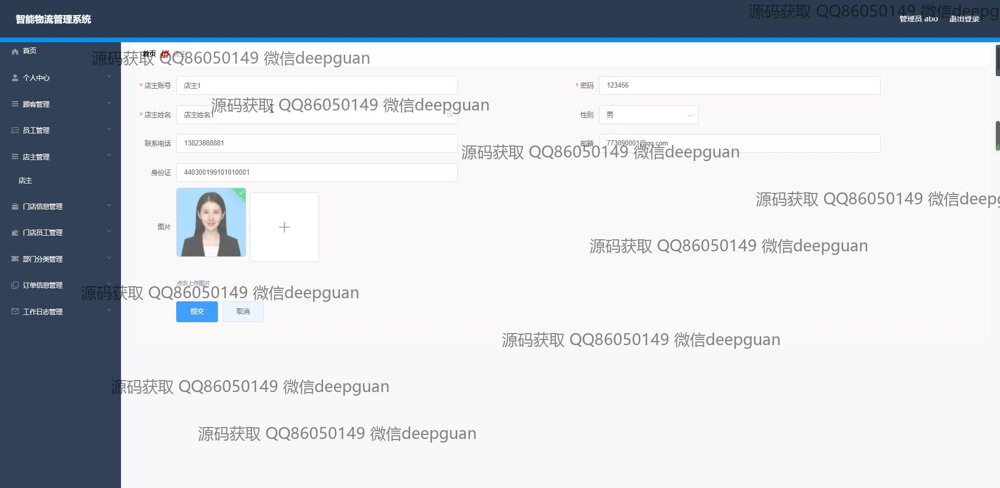
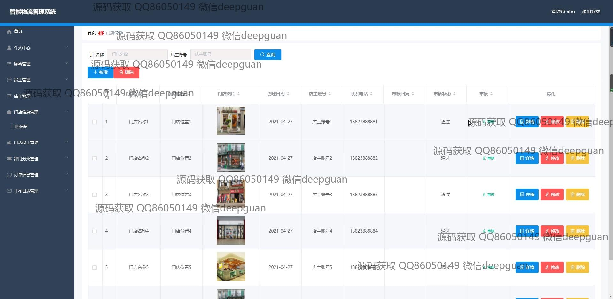
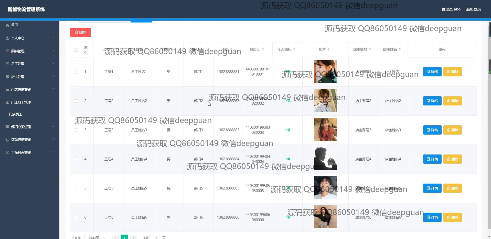
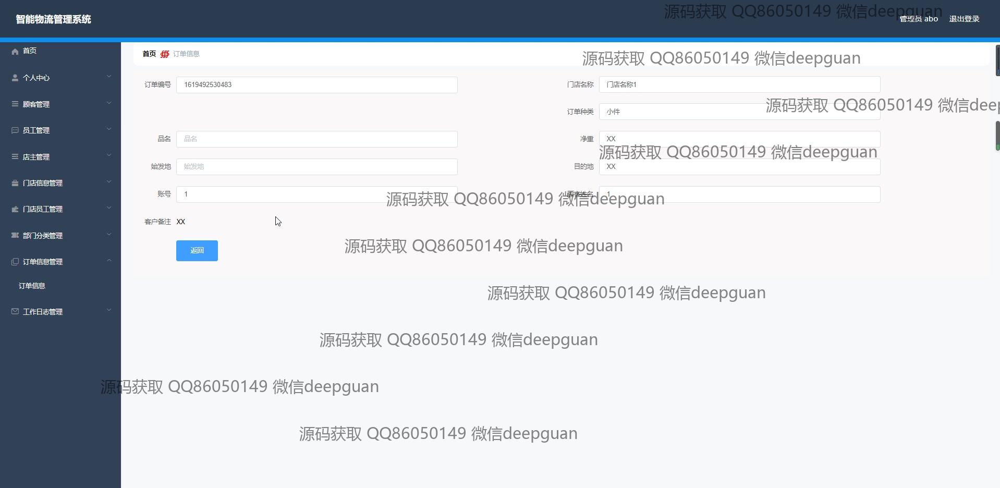
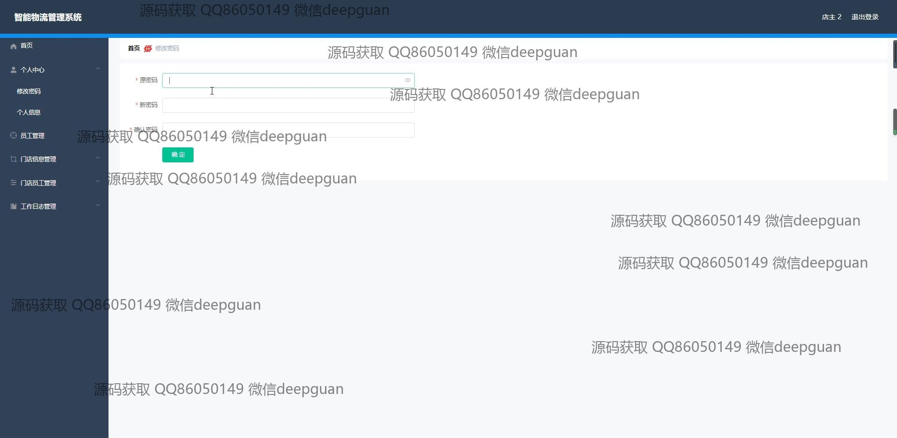
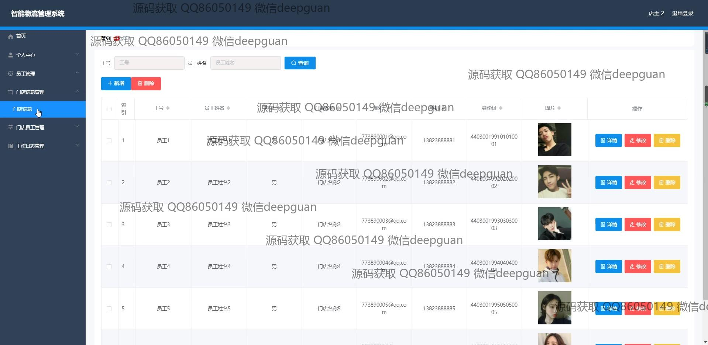
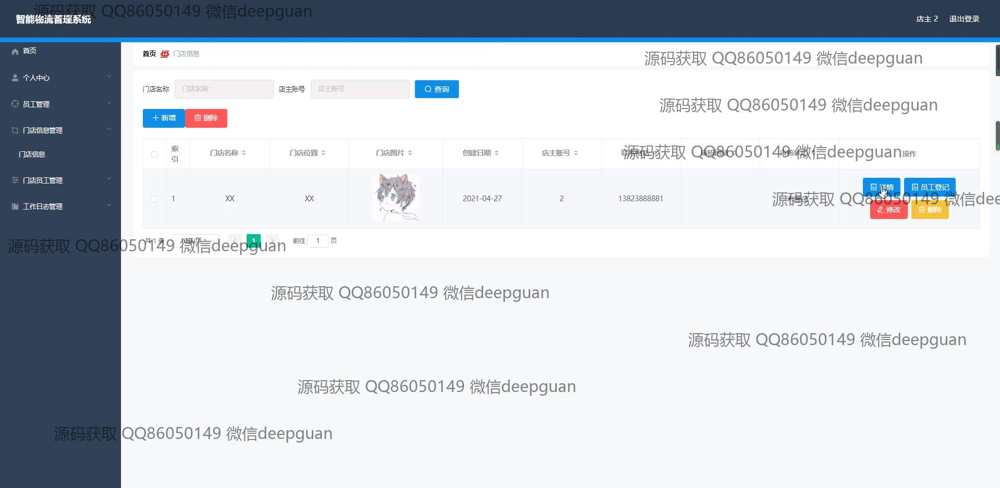
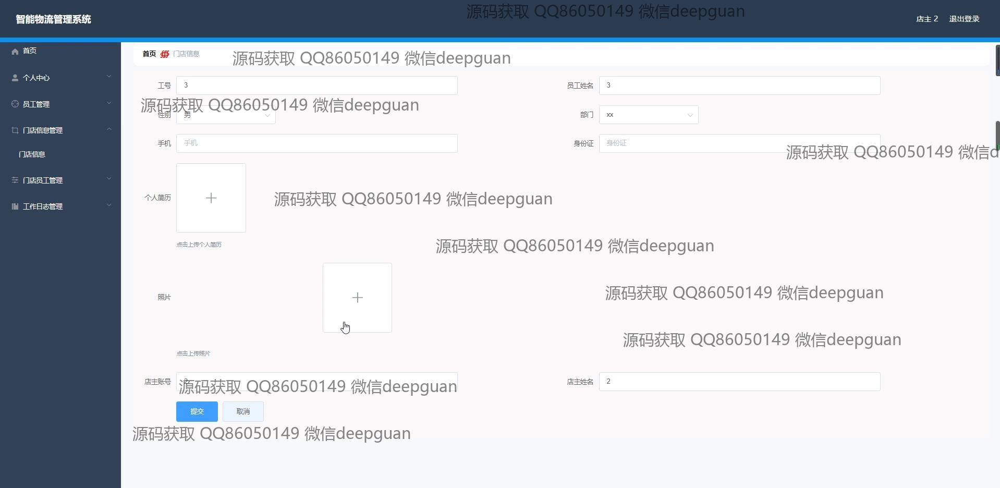
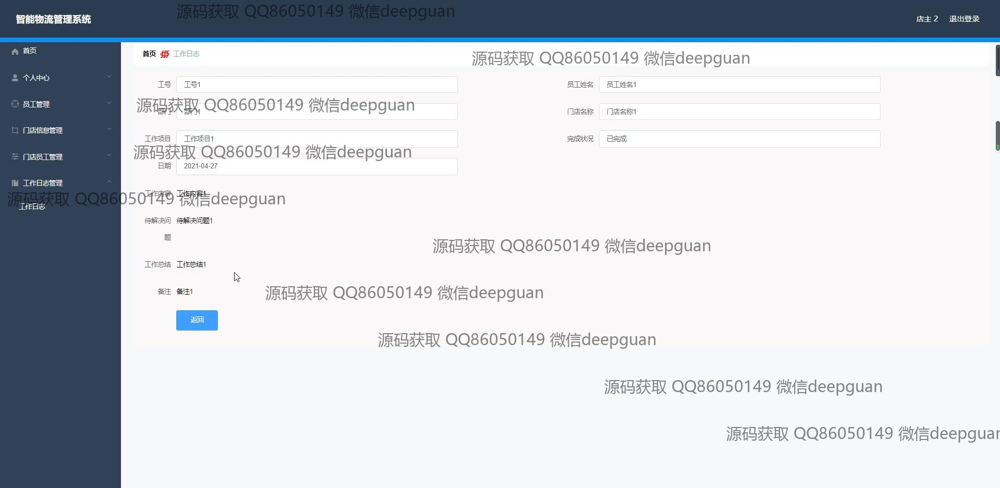
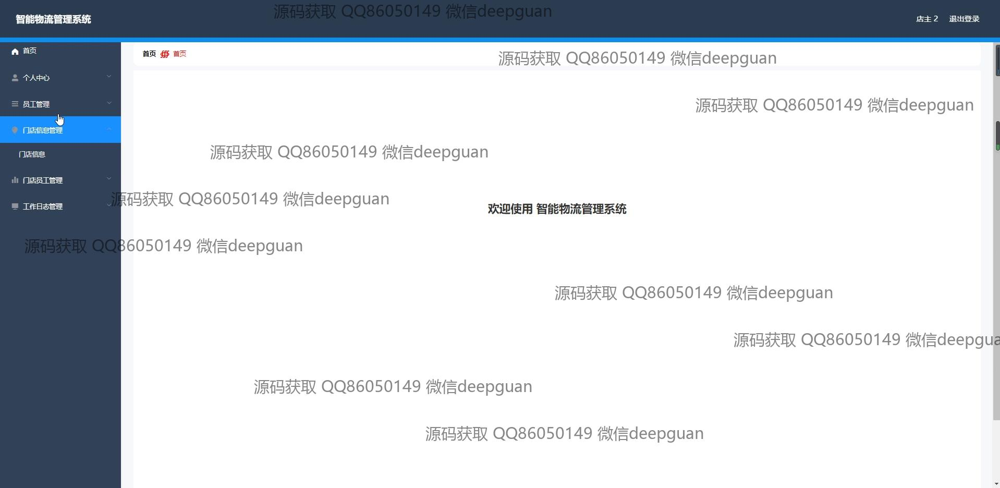
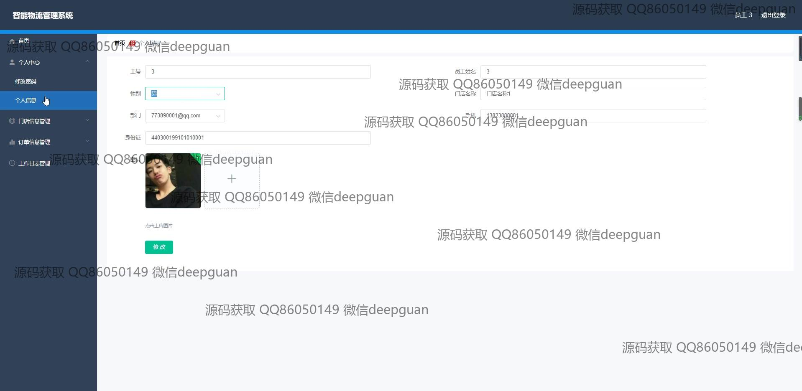
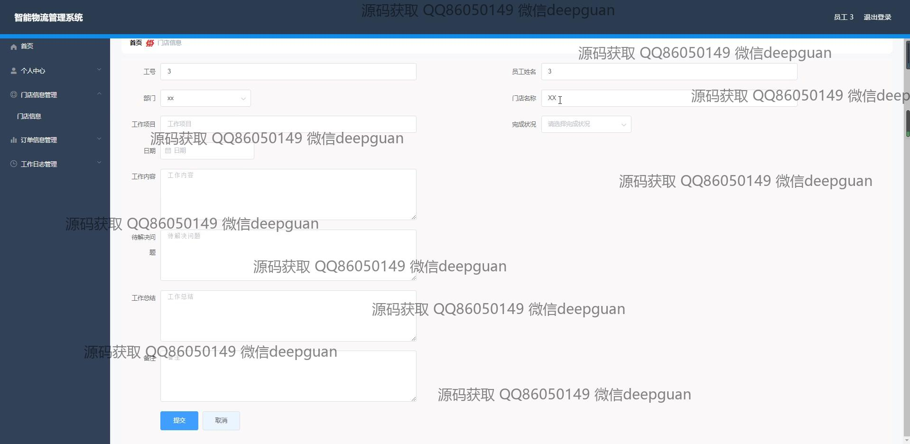
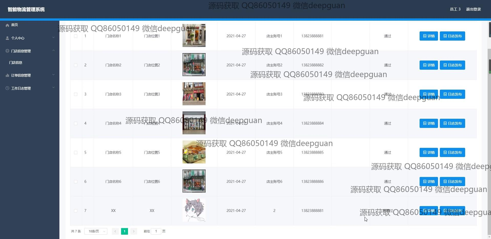
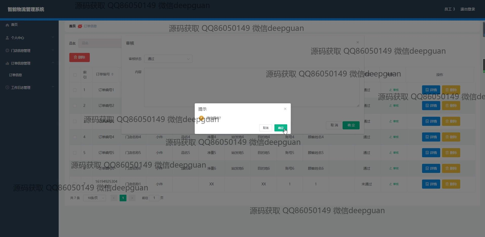
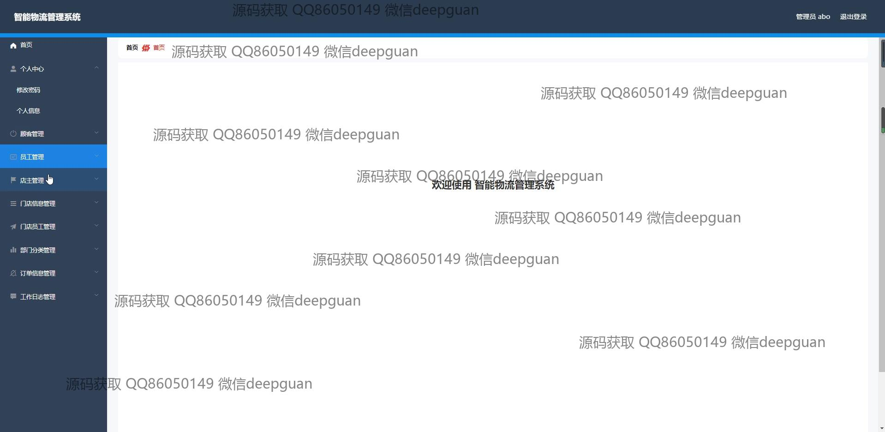
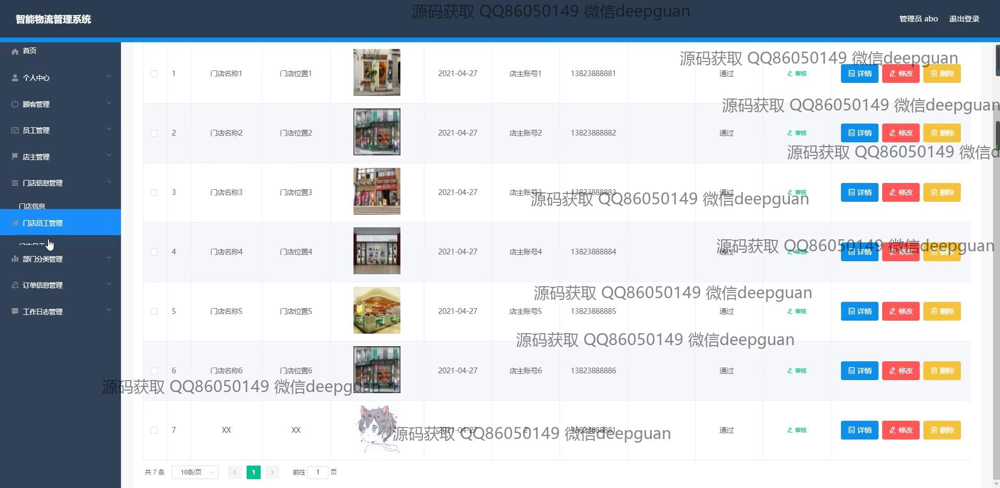

本代码来源于网络,仅供学习参考使用!

